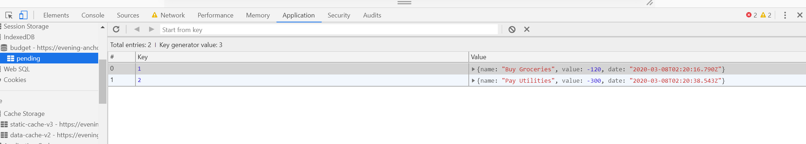

# Budget

## Description

This app allows a user to make changes to a budget online and offline.  Changes made offline will be automatically added once the app sees that it's online again.  Each offline change will be added to the IndexedDB locally and will add later to the MongoDB when it gets back online.  Make sure that the name of the transaction and amount is put in before adding or subtracting the amount inputed or you will get an error message.

## Deployment

Check out the deployed page here: https://evening-anchorage-14088.herokuapp.com/

## Local Deployment

-Clone repo onto your machine

-Run `npm install` or `npm i`.

-Run `npm start` or `node server.js`.

-Open your browser to: localhost:3300.

## Built with

-HTML

-Bootstrap

-Javascript

-Service Worker

-Manifest

-IndexedDB

## Packages Used

-Compression

-Mongoose

-MongoDB

-Morgan

-Express

## Images of Deployed Site

### Deployed Site

### Offline Feature

### Online Additions
